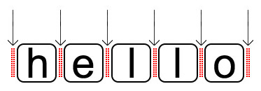
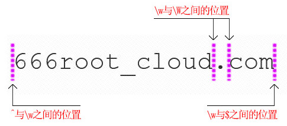
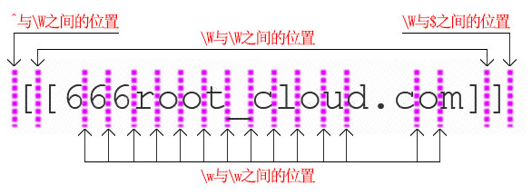

# javascript正则表达式<sup>谢忠阳</sup>

### 前言
正则表达式一直是困扰很多程序员的一门技术。前端面试过程中多少会被问到一些简单的正则表达式，但大部分应试者都会说：正则不是很了解，遇到问题都会直接搜索复制粘贴。我觉得作为程序开发者，有必要好好了解一下正则，因为很多问题都可以通过一条简单的正则表达式解决，避免写大量脚本去实现。希望这次分享能帮助大家掌握基础的正则，揭开正则表达式各种符号的神秘面纱，从此走上正则大神之路！

### 什么是正则表达式

来源于Perl的正则表达式是一门简单语言的语法规范，主要应用于字符串的信息实现查找、替换和提取的`技巧`操作。
这里强调是技巧操作，其处理字符串的速度是相当慢的，远不如indexOf、lastIndexOf、includes的速度快，所以勿滥用！但又必须学会，有些需求还非正则解决不了呢。
> 正则表达式的核心是：要么匹配`字符`，要么匹配`位置`！<br/>
> 正则：匹配`字符`，匹配`位置`！<br/>
> 正则：`字符` `位置`！

### 常见正则问题：
- 将123456789转化为`123,456,789`
- 验证密码必须8位以上，以字母开头，必须含有数字、大小写字母
- 剔除字符串中所有html的标签

## 正则表达式基础

### 原子（字符）

原子是正则表达式的最基本组成单位，而且必须至少要包含一个原子。

| 正则        　| 意思          | 说明  |
| ------------ |:-------------| -----|
|. |匹配除换行符以外的任意字符|加/s表示所有字符|
|\d |匹配一个数字字符|等价于 \[0-9]|
|\D |匹配一个非数字字符|等价于 \[^0-9]|
|\w |匹配包括下划线的任何单词字符|等价于\[A-Za-z0-9_]|
|\W |匹配任何非单词字符|等价于\[^A-Za-z0-9_]|
|\s |匹配任何空白字符，包括空格、制表符、换页符等等|等价于\[\f\n\r\t\v\u000B\u0020\u00A0\u2028\u2029]|
|\S |匹配任何非空白字符|等价于 \[^ \f\n\r\t\v]|
|\n |匹配一个换行符|等价于 \x0a 和 \cJ|
|\f |匹配一个换页符|等价于 \x0c 和 \cL|
|\r |匹配一个回车符|等价于 \x0d 和 \cM|
|\t |匹配一个制表符|等价于 \x09 和 \cI|
|\v |匹配一个垂直制表符|等价于 \x0b 和 \cK|
|\xxx |匹配八进制规定的ASCII编码字符|比如\[0-9]可写成\[\48-\57]|
|\xdd |匹配十六进制规定的ASCII编码字符|比如\[0-9]可写成\[\x30-\x39]|
|\uxxxx |匹配十六进制规定的Unicode字符|比如\[0-9]可写成\[\u0030-\u0039]|
|[A-Za-z]|匹配所有大小写字母| 等价于 /\[a-z]/i |
|[^a-z]|匹配非字母|匹配指定范围以外的字符|
|[a-f1-5]|自定义原子表又称`范围集合类`| |

#### 范围集合类
[abc]，表示a或者b或者c中的任意一个字符；
[a-z]、[A-Z]、[0-9]，表示小写字母，大写字母，0到9的数字；
[^a-z]、[^A-Z]、[^0-9]，表示非小写字母，非大写字母，非0到9的数字；

更多参见基本多语言面（Basic Multilingual Plane,BMP）详细信息[基本多文种平面](http://baike.baidu.com/view/628163.htm)

#### 分枝条件
`分枝条件`指的是有几种规则，如果满足其中任意一种规则都应该当成匹配，方法是用|把不同的规则分隔开。
```js
"aababxb".replace(/a|b/g,'')
```
### 元字符
元字符是一种特殊的字符，是用来修饰原子用的，不可以单独出现；
#### 量词类
| 正则        | 说明|
|------------|-----|
|{m} |表示前面的原子必须出现m次|
|{m,}|表示前面的原子最少出现m次|
|{m,n}|m要小于n,表示前面出现的原子，最少m次，最多n次，包括m和n次|
|?   |等价{0,1}表示其前面的原子可以出现0次或1次，有只能有一次，要么没有|
|+   |等价{1,}表示其前的原子可以出现1次或多次，不能没有最少要有一个|
|*   |等价{0,}表示其前的原子可以出现0次、1次、或多次|

##### 贪婪和非贪婪(懒惰)匹配
当正则表达式中包含能接受重复的限定符时，通常的行为是匹配尽可能多的字符。
```js
"aababxb".match(/a.*b/);//贪婪匹配 返回aababxb
"aababxb".match(/a.*?b/);//懒惰匹配 返回aab
```
它将会匹配整个字符串。这被称为贪婪匹配。

| 代码/语法| 说明       |
| ---------|-----------|
|{n,}?       |重复n次以上，但尽可能少重复|
|{n,m}?      |重复n到m次，但尽可能少重复|
| ??  	     |重复0次或1次，但尽可能少重复|
| +? 	     |重复1次或更多次，但尽可能少重复|
| *?	     |重复任意次，但尽可能少重复|

#### 边界类（位置）

位置可以理解为相邻字符之间的位置。咱们可以和空字符串进行类比, 字符的首尾、间隙都可以用空字符串进行连接。
```js
'hello' === '' + 'h' + '' + 'e' + '' + 'l' + '' +  'l' + '' + 'o' + ''
```


| 符号        | 说明|
|------------|-----|
|^  |脱字符，有m时是行的开头，无m是字符串的开始|
|$  |美元符，有m时是行的末尾，无m是字符串的结束|
|\b |单词的边界，具体讲有三点规则：①\w和\W之间的位置 ②^与\w之间的位置 ③\w与$之间的位置|
|\B |非单词的边界，与上面相反：①\w与\w之间的位置 ②\W与\W之间的位置 ③^与\W之间的位置 ④\W与$之间的位置|
```js
var regex = '666root_cloud.com'.replace(/\b/g,'❤')
```


```js
var regex = '[[666root_cloud.com]]'.replace(/\B/g,'❤')
```



## 正则表达式应用
### 创建正则表达式

```js
var reg = /xzy/i; //推荐
var reg = new RegExp('xzy', 'i'); //用于动态变量创建
var reg = new RegExp(/xzy/i);
var reg = new RegExp(/xzy/i, 'i');//ES5不允许；ES6可以并且第二个参数指定的修饰符会覆盖前面的修饰符
var reg = eval("/xzy/i");//不建议
var reg = new Function("return /xzy/i")();//不建议
console.dir(reg)
```
### RegExp实例属性
| 属性       | flags | 说明        |
| -----------|------|-------|
| lastIndex | | 下一次匹配开始的索引，初始值为0。可读写整型属性|
| dotAll　　 |/s| 允许`.`匹配换行符, ES7|
| flags  　　| | 返回正则表达式的修饰符, ES6|
| global    |/g| 全局搜索。匹配字符串中所有可能的字符，而不是仅匹配符合条件的第一项|
| hasIndices|/d| 为匹配子串生成开头和结尾的索引，索引通过 RegExpArray 的 indices 数组获得|
| ignoreCase|/i| 匹配文本的时候忽略大小写来进行搜索|
| multiline |/m| 多行搜索，这意味着在包含多个行的字符串中使用^和$符号时，会匹配每行的开头和结尾，而不是默认的只匹配整个字符串的开头和结尾|
| source 　　| | 正则表达式源码文本|
| sticky 　　|/y| 粘性搜索（ES6）。每次从lastIndex所标识的起始位置开始匹配，如果匹配失败将更新lastIndex为0；如果匹配成功将更新lastIndex为相应值，下次继续从lastIndex匹配。这里的“粘性”想表达的是只有当匹配项是连续的、相“粘连”的，搜索才会从当前下标位置继续下去，否则lastIndex归0从头开始。当 y 和 g 标志被同时使用时会省略 g 标志|
| unicode　　|/u| 开启Unicode功能。ES6|

- lastIndex
```js
var reg = /\d+/g
var str = '123abc'
console.log(reg.test(str)) // true
console.log(reg.lastIndex)
console.log(reg.test(str)) // false
```
- dotAll
```js
console.log(`abc
123`.match(/.+/s))
```
- global
```js
console.log(`1a2b3c`.replace(/\d+/g,'*'))
```
- flags
```js
var reg = new RegExp('a', 'sgdimyu')
console.log(reg.flags);//dgimsuy  ES6规范中规定了表达式的标识按照字符顺序输出，即dgimsuy
```
- hasIndices
```js
var str = 'foo bar foo'
var reg = new RegExp('foo', 'gd')
console.log(reg.hasIndices) // true
console.log(reg.exec(str).indices[0]) // Array [0, 3]
console.log(reg.exec(str).indices[0]) // Array [8, 11]
```
- ignoreCase
```js
console.log(`abcABC`.replace(/[a-z]/i,'*'))
```
- multiline
```js
console.log(`abc
ABC`.replace(/^\w+$/mg,''))
```
- source
```js
var reg = new RegExp('http?:\\/\\/', 'g')
console.log(reg.source); 
```
- sticky
```js
var reg = /a\d/y;
var str = "a1a2ka3";
console.log(reg.lastIndex,reg.exec(str));//0,["a1"]
console.log(reg.lastIndex,reg.exec(str));//2,["a2"]
console.log(reg.lastIndex,reg.exec(str));//4,null
console.log(reg.lastIndex,reg.exec(str));//0,["a1"]
```
>sticky 标志和 global 标志的不同点：如果正则表达式有粘性 y 标志，下一次匹配一定在 lastIndex 位置开始；如果正则表达式有全局 g 标志，下一次匹配可能在 lastIndex 位置开始，也可能在这个位置的后面开始。
```js
var reg = /\d/y;
while (r = reg.exec("123 456")) console.log(r, "AND re.lastIndex", reg.lastIndex);
var reg = /\d/g;
while (r = reg.exec("123 456")) console.log(r, "AND re.lastIndex", reg.lastIndex);
```
- unicode
>为了匹配其他语言中的字符，如西里尔（Cyrillic）或 希伯来语（Hebrew），要使用 \uhhhh，hhhh 表示以十六进制表示的字符的 Unicode 值。
```js
console.log(/\p{Emoji}/u.test('❤️')); //匹配表情字符
console.log(/\u{20BB7}/u.test('𠮷')); //true
```

### 正则相关方法

| 方法        　| 返回          | 注意  |
| ------------- |:-------------| -----|
| Regexp.exec(string) | 数组 or null | 与g、lastIndex有关 |
| Regexp.test(string) | true or false| 与g、lastIndex有关，不应该使用g |
| RegExp.compile(pattern [,flags]) |无返回|更改正则表达式模式并编译为内部格式【不推荐】|  
| String.match(regexp)| 数组 or null | 与g相关,没g时与exec类似 |
| String.matchAll(regexp)| 返回正则匹配的迭代器 | 必须含有g，否则报错 |
| String.replace(search,replace)| string | 与g相关$$,$&,$number,$`,$'|
| String.replaceAll(search,replace)| string | 正则时必须含有g，否则报错(ES12新增)|
| String.search(regexp)| index or -1 | 与indexOf类似，忽略g |
| String.split(separator[,limit])| 数组 | 忽略g，分组内容会存入数组 |

- Regexp.exec(string) 方法在一个指定字符串中执行一个搜索匹配。返回一个结果数组或 null。
```js
var regex = /fo*/g
var str = 'table football, foosball'
var array
while (array = regex.exec(str)) {
    console.log(`找到：${array[0]} 下次从 ${regex.lastIndex}开始查找`);
}
```
- Regexp.test(string)方法执行一个检索，用来查看正则表达式与指定的字符串是否匹配。返回 true 或 false。
```js
var regex = /fo*/g
var str = 'table football'
console.log(regex.test(str),regex.lastIndex) //true 9
console.log(regex.test(str),regex.lastIndex) //false 0

/[a-z]/i.test('AD%4521') // 忽略大小写
```
- RegExp.compile(pattern [,flags])运行脚本的期间（重新）编译正则表达式【不推荐】
>【已废弃:该特性已经从 Web 标准中删除，虽然一些浏览器目前仍然支持它，但也许会在未来的某个时间停止支持，请尽量不要使用该特性。】
```js
var reg = new RegExp('foo', 'gi')
console.dir(reg)
reg.compile('new foo', 'g')
console.dir(reg)
```
- String.match(regexp)方法检索返回一个字符串匹配正则表达式的结果。
```js
var str = 'Rootcloud.Com';
var reg = /[A-Z]/g;
console.log(str.match(reg)) //['R', 'C']
```
- String.matchAll(regexp)方法返回一个包含所有匹配正则表达式的结果及分组捕获组的迭代器。
```js
var str = 'hello javascript hello css'
console.log(...str.matchAll(/hello/g))
```
- String.replace(search,replace)方法返回一个用替换值替换搜索部分后的新字符串。搜索可以是字符串或一个正则表达式，替换值可以是字符串或者是回调函数。(见下面)

- String.search(regexp)方法执行正则表达式和 String 对象之间的一个搜索匹配。返回正则表达式在字符串中首次匹配项的索引或-1。
```js
'Rootcloud.Com'.search(/com/) // -1
```
- String.split(separator[,limit])方法使用指定的分隔符字符串将一个String对象分割成子字符串数组，以一个指定的分割字串来决定每个拆分的位置。
```js
var str = 'Hello  World. How are you doing?'
var reg = str.split(/\s+/, 3)
//var reg = str.split(/(\s+)/)
console.log(reg)
```

### 精讲String.prototype.replace()
语法
>str.replace(regexp|substr, newSubStr|function)

参数：
- regexp (pattern)
>一个RegExp 对象或者其字面量。该正则所匹配的内容会被第二个参数的返回值替换掉。
- substr (pattern)
>一个将被 newSubStr 替换的 字符串。其被视为一整个字符串，而不是一个正则表达式。仅第一个匹配项会被替换。
- newSubStr (replacement)
>用于替换掉第一个参数在原字符串中的匹配部分的字符串。该字符串中可以内插一些特殊的`变量名`。

特殊变量名表：

| 变量名| 说明        |
| ---------|-------------|
| $$	|直接量符号，即$字符|
| $n  |第n个子表达式相匹配的文本,n等于[1-9]。等于RegExp.$n|
| $_  |正则搜索的字符串。等于RegExp.input|
| $&  |正则最后一次匹配的字符串。等于RegExp.lastMatch|
| $+  |正则最后一个分组内容。等于RegExp.lastParen|
| $`  |正则匹配子串左侧的文本。等于RegExp.leftContext|
| $'  |正则匹配子串右侧的文本。等于RegExp.rightContext|

```js
/(\d)(\d)/.test('left89right')
console.dir(RegExp)
/*
RegExp.$1 = '8';
RegExp.$2 = '9';
RegExp.$_ = RegExp.input = 'left89right';
RegExp['$&'] = RegExp.lastMatch = '89';
RegExp['$+'] = RegExp.lastParen = '9';
RegExp['$`'] = RegExp.leftContext = 'left';
RegExp['$\''] = RegExp.rightContext = 'right';
*/
```
- function (replacement)
>一个用来创建新子字符串的函数，该函数的返回值将替换掉第一个参数匹配到的结果。

- 指定一个函数作为参数
>你可以指定一个函数作为第二个参数。在这种情况下，当匹配执行后，该函数就会执行。 函数的返回值作为替换字符串。 (注意：上面提到的特殊替换参数在这里不能被使用。) 另外要注意的是，如果第一个参数是正则表达式，并且其为全局匹配模式，那么这个方法将被多次调用，每次匹配都会被调用。

下面是该函数的参数：

| 变量名| 代表的值 |
| ---------|-------------|
| match	|匹配的子串。对应于上述的$&|
| p1,p2, ...  |代表第n个括号匹配的字符串,等于RegExp.$n|
| offset  |匹配到的子字符串在原字符串中的偏移量，等于index|
| string  |被匹配的原字符串|
| NamedCaptureGroup  |命名捕获组匹配的对象|
```js
var str = 'abc12345#$*%10'.replace(/(\D+)(\d+)(?<w>\W+)/, function (match, p1, p2, p3, offset, string, group) {
    console.log(match, p1, p2, p3, offset, string, group)
    return [p1, p2, p3].join(' - ')
})
console.log(str)  // abc - 12345 - #$*%
```
## 正则分组

用小括号来指定`子表达式`(也叫做分组)。
```js
var reg = /(\d{1,3}\.){3}\d{1,3}/
var reg = /((2[0-4]\d|25[0-5]|[01]?\d\d?)\.){3}(2[0-4]\d|25[0-5]|[01]?\d\d?)/
```
| 代码/语法| 说明        |
| ---------|-------------|
| (exp)	   |匹配exp,并捕获文本到自动命名的组里|
| (?:exp)  |匹配exp,不捕获匹配的文本，也不给此分组分配组号|
| (?\<name\>exp) |匹配exp,并捕获文本到名称为name的组里|
```js
"%12sd@32%sdf sdf@3".replace(/(?:@|%)(\d+)/g,'$1')
console.log('Rootcloud.Com'.match(/(?<a>o+)(?<b>\w+?)/))
```

#### 反向引用（回溯引用）
使用小括号指定一个子表达式后，默认情况下，每个分组会自动拥有一个组号，规则是：从左向右，以分组的左括号为标志，第一个出现的分组的组号为1，第二个为2，以此类推(等于RegExp.$n)。你可以使用(?:exp)这样的语法来剥夺一个分组对组号分配的参与权。
```js
var reg = /<(\w)>.*?<\1>/  //匹配html标签
var str = 'abc%45,efd%12'.replace(/(%)(\d+)/g,'$2$1') //互换字符
```

## 正则表达式断言<sup>高级</sup>
>当我们想要查找类似\b,^,$那样的一个位置，这个位置应该满足一定的条件(即断言)，但这个位置并不包含任何内容，我们称之为`零宽断言`。又称之为`环视`(lookaround)结构。

### 零宽断言
| 代码/语法| 说明        |名称        |
| ---------|-------------|-------------|
| x(?=exp)y |断言y部分能匹配exp,与x无关|零宽度正预测先行断言,肯定顺序环视,正向前瞻,正向预查,向前断言|
| x(?!exp)y |断言y部分不能匹配exp,与x无关|零宽度负预测先行断言,否定顺序环视,负向前瞻,负向预查,向前否定断言|
| x(?<=exp)y |断言x部分能匹配exp，且exp从右到左匹配，与y无关。ES7支持|零宽度正回顾后行断言,肯定逆序环视,向后断言|
| x(?<!exp)y |断言x部分不能匹配exp，且exp从右到左匹配，与y无关。ES7支持|零宽度负回顾后发断言,否定逆序环视,向后否定断言|


```js
/\d+(?=%)/.exec('99 and 100%')  // ["100"]

//我们需要匹配a,且a后面不能是c。如果写成/a[^c]/g将无法匹配最后一个a,因为[^c]占了一个字符宽度
'abaca'.match(/a(?!c)/g);//(?!c)是不占宽度，也不计入返回结果

"mmxxsdfsdfmmmsdfsdfmm".match(/(?<!m)mm(?!m)/g);

/(?<=(\d+)(\d+))$/.exec('1053') // ["", "1", "053"]
var reg = /(\d+)(\d+)/.exec('1053') // ["1053", "105", "3"]
var reg = /(?<=(o)d\1)r/.exec('hodor')  // null
var reg = /(?<=\1d(o))r/.exec('hodor')  // ["r", "o"]
```
后行断言的特点是从右向左匹配，分组编号虽然一样从左到右分配，但引用时必须在编号的左边引用。

### 字符转义
\/[\](){}?+*|.^$-作为字符来匹配必须转义，才能作为正则的原子。
```js
function escapeRegExp(str) {
  return str.replace(/[.*+?|^$()[\]{\\]/g, '\\$&');
}
//ES7将新增RegExp对象的静态方法RegExp.escape()
RegExp.escape('(*.*)');
// "\(\*\.\*\)"
```

### 正则表达式实例
```js
//去除字符串两端的空格
String.prototype.trim = String.prototype.trim || function (){ return this.replace(/^\s+|\s+$/g,"")};

//数字千分位
'123456789.25'.replace(/(\d)(?=(\d{3})+\b)/g,'$1,')

//格式化HTML
String(text).replace(/&/g,'&amp;').replace(/\</g,'&lt;').replace(/\>/g,'&gt;')
.replace(/"/g, '&quot;').replace(/'/g, '&#39;');

//密码规则
var reg1 = /^[a-z\d!@＃$％^&*()_ \- +=?]{8,}$/i;
var reg2 = /^(?=.*\d)[a-z\d!@＃$％^&*()_ \- +=?]{8,}$/i;//必须含有数字
var reg3 = /^(?!\d+$)[a-z\d!@＃$％^&*()_ \- +=?]{8,}$/i;//不能全是数字
var reg4 = /^(?!\d+$|[a-z]+$|[!@＃$％^&*()_ \- +=?]+$)[a-z\d!@＃$％^&*()_ \- +=?]{8,}$/i;//不能只含一种字符（即必须含有两种以上）
var reg5 = /^(?=.*\d)(?=.*[a-z])(?=.*[!@＃$％^&*()_ \- +=?])[a-z\d!@＃$％^&*()_ \- +=?]{8,}$/i;//必须含有三种以字符
```
### 性能
核心：减少“回溯”次数，尽快匹配结果：
- 1、尽量使用边界符（^、$、\b、\B等），限定搜索字符串位置
- 2、使用具体的元字符（\d、\w、\s等），少用”.”字符
- 3、多使用确定的量词（{n}、{n,m}），少用贪婪匹配
- 4、减少分支，减少“回溯”

### 正则辅助网站
[在线正则：https://regex101.com/](https://regex101.com/)

[可视化正则：https://jex.im/regulex](https://jex.im/regulex)

[可视化正则：https://regexper.com/](https://regexper.com/)

[可视化正则：https://www.debuggex.com/](https://www.debuggex.com/)
